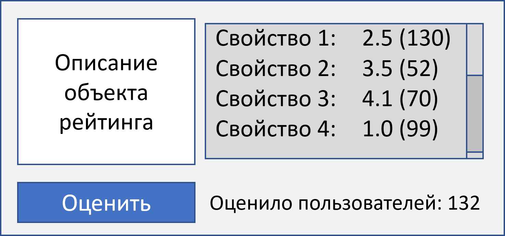
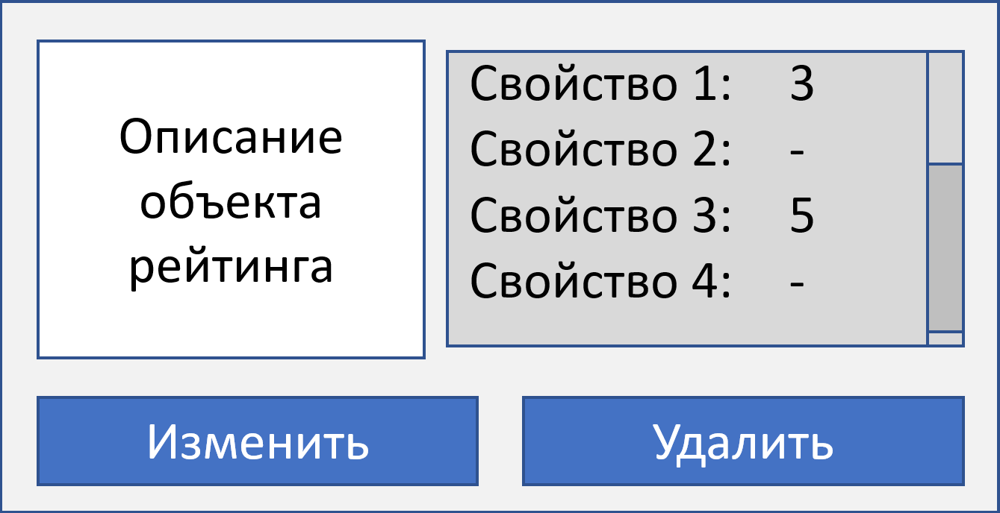

# Ratings
A microservice for managing ratings (user, article, product, etc)

Учебный проект в рамках курса [Kotlin Backend Developer](https://otus.ru/lessons/kotlin/?int_source=courses_catalog&int_term=programming) (декабрь 2022)

## Визуальная схема фронтенда
### Карточка объекта со средними оценками

Если пользователь уже оценивал объект, 
то вместо кнопки «Оценить» выводится кнопка «Изменить оценку»

### Карточка объекта в кабинете пользователя

## Документация

1. Маркетинг (шаблон)
    1. [Заинтересанты](./docs/01-marketing/01-stakeholders.md)
    2. [Целевая аудитория](./docs/01-marketing/02-target-audience.md)
    3. [Конкурентный анализ](./docs/01-marketing/03-concurrency.md)
    4. [Анализ экономики](./docs/01-marketing/04-economy.md)
    5. [Пользовательские истории](./docs/01-marketing/05-user-stories.md)
2. DevOps
    1. [Схема инфраструктуры](./docs/02-devops/01-infrastruture.md)
    2. [Схема мониторинга](./docs/02-devops/02-monitoring.md)
3. Тесты
4. Архитектура
    1. [Компонентная схема](./docs/04-architecture/01-arch.md)
    2. [Интеграционная схема](./docs/04-architecture/02-integration.md)
    3. [Описание API](./docs/04-architecture/03-api.md)
