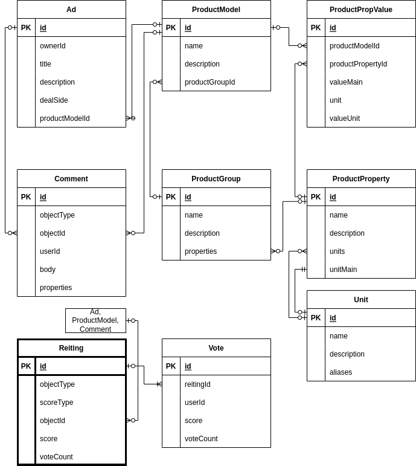

# API

## Функции (эндпониты)

1. CRUDS (create, read, update, delete, search) для объектов рейтинга (Reiting)

## Описание сущности Reiting
1. ObjectID - уникальный идентификатор
2. ObjectType - объекта оценки (пользователь, товар, сервис, комментарий и тд)
3. ScoreType - параметр оценки (свойство / качество)
4. Score - оценка рейтинга
5. VoteCount - количество голосов

## Reiting в структуре проектов [группы CrowdProj project](https://github.com/crowdproj)
